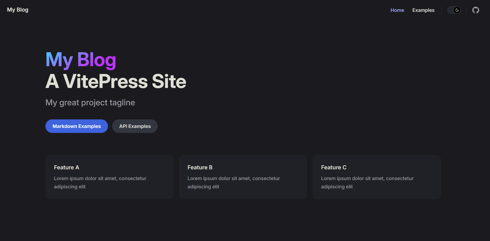

# 基于 VitePress 搭建

::: tip
本文只介绍简略的搭建过程，具体请参考 [VitePress 官方文档](https://vitepress.dev/zh/)
:::


## 初始化

> 环境：Node.js 18 及以上版本

1. 安装 vitepress 依赖

```shell
npm add -D vitepress
```

2. 初始化

```shell
npx vitepress init

┌  Welcome to VitePress!
│
◇  Where should VitePress initialize the config?
│  ./docs
│
◇  Site title:
│  My Blog
│
◇  Site description:
│  A VitePress Site
│
◇  Theme:
│  Default Theme + Customization
│
◇  Use TypeScript for config and theme files?
│  Yes
│
◇  Add VitePress npm scripts to package.json?
│  Yes
│
└  Done! Now run npm run docs:dev and start writing.

Tips:
- Since you've chosen to customize the theme, you should also explicitly install vue as a dev dependency.
```

上边配置了初始化目录，站点标题以及描述，主题选择的是默认 + 定制，所以会有下边的 Tips，提示我们还需另外安装 vue 依赖：

```shell
npm install vue
```


## 启动

``` shell
npm run docs:dev
```
启动成功，如下图所示：

至此，博客的基础框架就已经搭建完成了！后边需要自己修改细节。


## 目录结构

```
.
├─ docs                       # VitePress 站点的项目根目录（初始化时配置的）
│  ├─ .vitepress              # 配置相关目录
│  │  ├─ theme                # 主题相关
│  │  │  ├─ index.ts
│  │  │  └─ style.css
│  │  └─ config.mts           # 站点配置文件
│  ├─ api-examples.md         # 初始样例页面
│  ├─ markdown-examples.md    # 初始样例页面
│  └─ index.md                # 初始主页
├─ node_modules
├─ package.json
└─ package-lock.json
```


## 站点配置

配置文件 `.vitepress/config.mts` 中可以自定义站点，配置参考：[站点配置](https://vitepress.dev/zh/reference/site-config)

```typescript
import { defineConfig } from 'vitepress'

export default defineConfig({
  // 站点级选项
  title: "My Blog",
  description: "A VitePress Site",
  themeConfig: {
    // 主题级选项
  }
})

```

## 修改主页
主页内容对应根目录下的 `index.md` 文件，初始如下：

```md
---
layout: home

hero:
  name: "My Blog"
  text: "A VitePress Site"
  tagline: My great project tagline
  actions:
    - theme: brand
      text: Markdown Examples
      link: /markdown-examples
    - theme: alt
      text: API Examples
      link: /api-examples

features:
  - title: Feature A
    details: Lorem ipsum dolor sit amet, consectetur adipiscing elit
  - title: Feature B
    details: Lorem ipsum dolor sit amet, consectetur adipiscing elit
  - title: Feature C
    details: Lorem ipsum dolor sit amet, consectetur adipiscing elit
---
```

这里不过多解释，官方文档介绍很详细：[主页配置](https://vitepress.dev/zh/reference/default-theme-home-page)