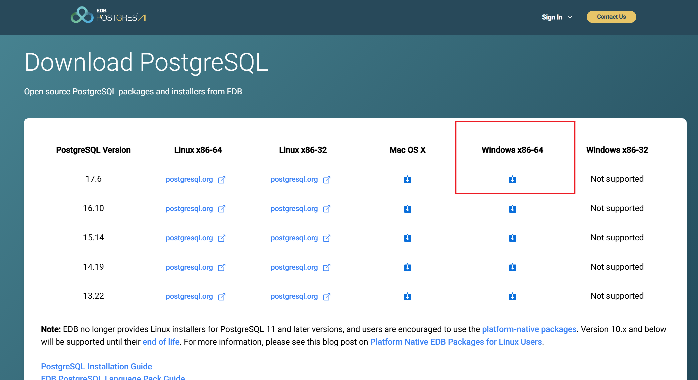

---
prev:
  text: '数据库安装'
  link: '/course/database'

next:
  text: '安装 PostGIS 扩展'
  link: '/course/database/postgis'
---

# PostgreSQL 安装

::: tip 参考
参考文章：[PostgreSQL安装、配置与卸载教程（Windows版）](https://www.icode504.com/posts/35.html)
:::

## 下载

1. 进入官网：[点击进入](https://www.enterprisedb.com/downloads/postgres-postgresql-downloads)
2. 根据自己的操作系统下载，这里我选择的是 Windows 版 PostgreSQL 17版本

## 安装

::: warning
由于本机环境问题，安装部分请参考上方的参考文章
:::