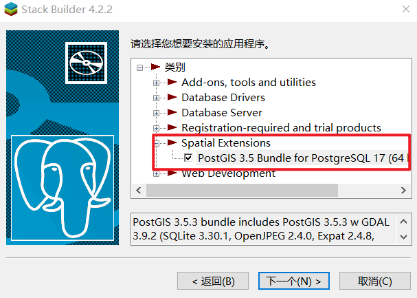

---
prev:
  text: 'PostgreSQL 安装教程(Windows)'
  link: '/course/database/pgsql'

next: false
---

# 安装 PostGIS 扩展

::: tip 安装方式
这里主要介绍两种安装方式：
- 通过 `Stackbuilder` 下载
- 在官网手动下载安装包

由于我在安装过程中遇到了 Stackbuilder 无响应的问题，所以主要介绍手动下载方式
:::

## 手动方式下载

1. 进入官网找到对应的版本：[点击进入](https://download.osgeo.org/postgis/windows/)

2. 选择安装程序，下载之后打开：

3. I Agree > 如下图勾选后 Next > 安装到 PostgreSQL 所在文件夹下即可：

## Stackbuilder 安装

`Stackbuilder` 是 `PostgreSQL` 的辅助安装工具，安装 `PGSQL` 时已经自动安装。

1. 启动 Stackbuilder：在 `bin` 目录下可以找到该程序：

2. 选择数据库：

3. 找到 PostGIS，然后下一步，选择安装位置，等待安装即可：
