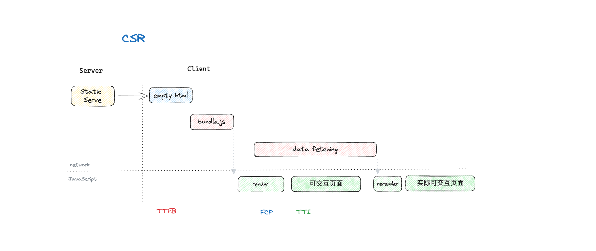
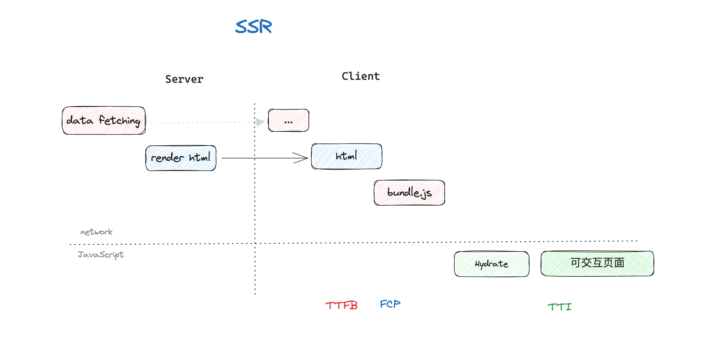
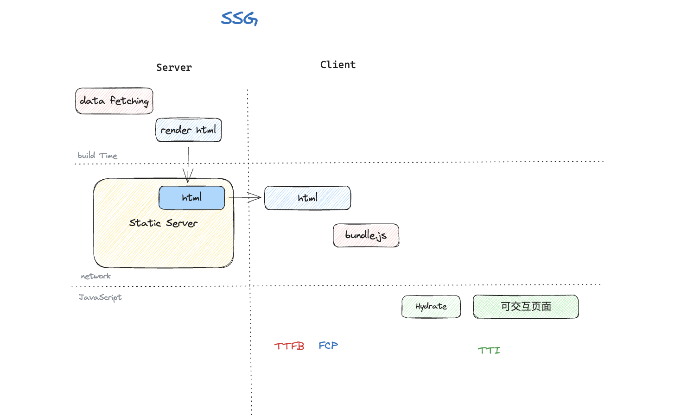

---
prev:
  text: 'CSS'
  link: '/notes/css'

next: 
  text: 'Vue'
  link: '/notes/vue'

title: '前端渲染模式'
---

# {{ $frontmatter.title }}

::: info 前言

本文暂时仅介绍 CSR、SSR 和 SSG 三种常见的渲染模式，更多可以参考下边两篇不错的文章

> 参考文章：
> - [一文带你了解前端渲染模式演进史](https://juejin.cn/post/7293500966212583465)
> - [现代前端框架的渲染模式](https://cloud.tencent.com/developer/article/2347380)
:::

## 简介

渲染模式简单来说就是 Web 页面内容渲染的方式，决定了 HTML 如何生成以及传递到浏览器的方式。

## 渲染模式的选择

渲染模式的选择主要从：**首屏速度、交互延迟、SEO、稳定性、成本** （性能和用户体验）几方面考虑。

我们需要根据不同的业务场景来选择合适的渲染模式。

|模式|渲染时机|         首屏性能         |SEO 友好|动态性|          适用场景          |开发成本|
|---|-------|------------------------|:------:|:--:|---------------------------|:-----:|
|CSR| 客户端 |    较差（首屏依赖 JS）    |   一般  | 高 |       后台系统、强交互         |一般|
|SSR| 服务端 |    好（首屏 HTML 直出）   |   好   | 高 |     首屏快且数据频繁更新        |较高|
|SSG| 构建时 | 优（静态 HTML，CDN 分发） |   优   | 低 | 文档、博客、营销页、静态展示型网站 |较低|

## CSR 客户端渲染

CSR（Client-Side Rendering）是目前最常见、最流行的渲染模式，在 Vue、React 等主流框架中默认渲染模式就是 CSR。

渲染时机：客户端

优点：
- 部署简单
- 通过 SPA 实现复杂且友好的交互体验

缺点：
- 首屏性能较差
- SEO 不友好

**适用场景**：首屏性能要求不高，注重交互体验，资源成本有限的页面

## SSR 服务端渲染

SSR（Server-Side Rendering）将获取数据的过程放在了服务端，主要解决 CSR 首屏性能和 SEO 问题。

渲染时机：服务端

优点：
- 首屏性能好，用户更快看到内容
- SEO 友好

缺点：
- 服务器成本较高，需要部署和维护 Nodejs 服务器

**适用场景**：需要 SEO 优化，注重首屏性能

## SSG 静态生成

SSG（Static Side Generation）利用动态数据构建渲染，因为是静态的，部署在静态服务器即可。纯静态页面也可以使用 SSG 构建。

渲染时机：构建时

优点：
- 支持动态数据
- 服务器成本低
- 页面性能好
- SEO 友好

缺点：
- 适用场景有限

**适用场景**：纯静态页面、静态数据多或数据更新不频繁的页面